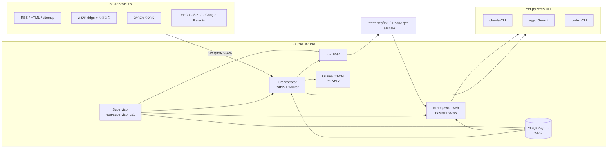

<div dir="rtl">

# EO-Analyst — מפרט דרישות טכניות וממשק הפעלה

| | |
|---|---|
| **מערכת** | EO-Analyst — סוכן אנליסט OSINT מקומי לתעשיית האלקטרו-אופטיקה הביטחונית (EO/IR/CV) |
| **ריפו** | https://github.com/cohyos/EO-analyst (ענף `main`) |
| **גרסת קוד** | commit `5ec121a` ואילך — הגרסה שאושרה לפריסה בביקורת החיצונית השישית (24.9.2026) |
| **תאריך המסמך** | 25.9.2026 |
| **מטרת המסמך** | לאפשר הקמה של מערכת דומה בסביבה אחרת: מה המערכת עושה, ממה היא בנויה, מה היא דורשת, ואיך מפעילים אותה |
| **מקור האמת** | הקוד והקונפיגורציה ב-HEAD. כשמסמך ישן ב-`docs/` סותר את הקוד, הקוד קובע |

המסמך בנוי משני חלקים. **חלק א'** הוא מפרט הדרישות הטכניות: ארכיטקטורה, סביבה, שרשרת העיבוד, שכבת המודלים, מודל הנתונים, המוצרים, התזמון והאבטחה. **חלק ב'** הוא ממשק ההפעלה: התקנה, פקודות, מסכי האפליקציה, שגרת העבודה, ה-API ותחזוקה.

---

# חלק א' — מפרט דרישות טכניות

## 1. מה המערכת עושה

EO-Analyst היא מערכת שרצה על מחשב אחד ומחליפה עבודת אנליסט שוק ומודיעין עסקי בתחום האלקטרו-אופטיקה. בכל לילה היא:

1. **אוספת** פרסומים מ-95 מקורות (RSS, דפי HTML, sitemap וחיפושים ממוקדים, כולל פוסטים של חברות בלינקדאין).
2. **מנקה ומסננת**: מזהה כפילויות (גם בין שפות), מסווגת לפי טקסונומיה של 9 תחומים, ומדרגת חשיבות בסולם 1–10 עם רמות אדום/כתום/צהוב/ארכיון.
3. **מנתחת** כל פריט רלוונטי: תקציר בעברית, "מה זה אומר לנו", עובדות מפתח, אירועים עסקיים, ישויות וקשרים ביניהן.
4. **מצליבה** מקורות (אימות עצמאי), מאחדת כתבות על אותו סיפור, ומריצה חקירות עומק על פריטים אדומים.
5. **סורקת** 42 פורטלי מכרזים/RFI/RFP ומחזה מכרזים עתידיים, סורקת פטנטים ועוקבת אחרי כנסים.
6. **מפיקה דוחות בעברית** (docx/html/md) עם ציטוט מקור לכל טענה: יומי, טכנולוגי-יומי, שבועי, חודשי, פיתוח עסקי לפי טריטוריה וקו מוצר.
7. **מתריעה** לטלפון (ntfy) ומגישה הכול בממשק web בעברית, כולל צ'אט "שאל את האנליסט".

### עקרונות תכנון

- **מקומי-תחילה**: הנתונים, מסד הנתונים והממשק רצים על המחשב; שום פורט לא נפתח לאינטרנט.
- **שרשרת מודלים בענן עם נפילה למקומי**: כל תפקיד (סיווג, ניתוח, חקירה, דוחות) רץ על שרשרת ספקים מסודרת (Claude → Gemini → Claude Opus → Ollama מקומי), כך שתקלה בספק אחד לא עוצרת את הריצה.
- **ציטוט מובנה**: כל משפט עובדתי בדוח נושא מספר מקור כבר בשלב הניסוח (סכמה מובנית), ובדיקת QA חוסמת דוח לא מצוטט.
- **אבטחת תוכן**: כל טקסט חיצוני עובר סינון הזרקות פרומפט לפני שמודל רואה אותו, וכל פנייה לרשת עוברת הגנת SSRF.
- **"אין חדש — אין חדש"**: דוח לא ממלא חורים בטקסט כללי; אם אין התפתחות בתחום, כתוב שאין.
- **אמינות תפעולית**: כל שלב בריצה הלילית מוגבל בזמן, נכשל בנפרד, ונרשם ביומן; הדוח וההתראה הם שלבי חובה שתמיד רצים.

## 2. ארכיטקטורה



### 2.1 רכיבים ותהליכים

| רכיב | הפעלה | פורט | תפקיד |
|---|---|---|---|
| **Supervisor** | `pwsh scripts\native\eoa-supervisor.ps1` (מופעל ע"י `eo native start` או Task Scheduler) | — | מרים את כל התהליכים לפי הסדר, מאתחל מחדש בנפילה, מבצע בדיקת בריאות כל 60 שניות, מנקה תהליכים יתומים |
| **PostgreSQL 17** | `runtime\pgsql\bin\pg_ctl.exe -D runtime\pgdata` | 5432 | מסד הנתונים היחיד — כל המצב של המערכת |
| **ntfy** | `runtime\ntfy\ntfy.exe serve` | 8091 | שרת התראות מקומי (פוש לטלפון) |
| **Orchestrator** | `.venv\Scripts\python.exe -m eoa.orchestrator.main` | — | מתזמן (APScheduler) + worker יחיד שמריץ את כל העבודות מתור ה-`jobs`; כולל גם את האיסוף |
| **API + Web** | `python -m uvicorn eoa.api.app:app --host 127.0.0.1 --port 8765` | 8765 | REST + WebSocket + SSE, ומגיש את ה-SPA הבנוי מ-`web/dist` |
| **Ollama** | שירות חיצוני של מערכת ההפעלה (לא מנוהל ע"י ה-supervisor) | 11434 | מודלים מקומיים — חוליה אחרונה בכל שרשרת, ומודל ה-embeddings |
| **ספקי CLI** | `claude`, `agy`, `codex` ב-PATH | — | קריאות למודלי ענן דרך מנויים (subprocess לכל קריאה) |

**פריסה חלופית (לא פעילה):** `docker-compose.yml` ו-`docker/` מתארים פריסה ישנה במכולות (postgres עם pgvector+AGE, searxng, ntfy, fetcher, agent, web) עם הפרדת רשתות. היא הוחלפה בפריסה הנייטיבית (ADR-004) ונשמרת כמסמך עזר — שימושית אם מקימים את המערכת על Linux.

**החלפות בין הפריסות:** pgvector → עמודת `REAL[]` + דמיון קוסינוס ב-numpy; Apache AGE → טבלת `graph_edges` + CTE רקורסיבי; SearXNG → ספריית `ddgs` בתוך התהליך; שלוש מכולות → תהליך orchestrator אחד + תהליך API אחד.

## 3. דרישות סביבה

### 3.1 מחשב הייחוס (עליו המערכת רצה היום)

| פריט | ערך |
|---|---|
| מערכת הפעלה | Windows 11 Home, PowerShell 7 |
| מעבד | Intel Core Ultra 9 275HX (24 ליבות) |
| זיכרון | 64 GB RAM |
| GPU | NVIDIA GeForce RTX 5070 Ti Laptop, 12 GB VRAM |
| רשת | חיבור אינטרנט יוצא; Tailscale לגישה מהטלפון |

### 3.2 דרישות מינימום מומלצות

| מצב עבודה | GPU | RAM | דיסק פנוי |
|---|---|---|---|
| **ענן (המצב הנוכחי)** — כל המודלים בענן, Ollama רק ל-embeddings ולגיבוי | לא חובה (embeddings רצים גם על CPU, לאט יותר) | 16 GB | 40 GB (עצירה מתחת ל-20 GB) |
| **מקומי מלא** — מודלי 12B ב-Ollama | 12 GB VRAM לפחות (תפקיד ראשי דורש 9.5 GB פנויים) | 32 GB | 80 GB (מודלים + נתונים) |

שער המשאבים (`agent/eoa/resources/gate.py`) בודק לפני כל קריאה למודל מקומי: VRAM פנוי לפי תפקיד (ראשי 9,500 MB, קל 6,000 MB, embeddings 1,500 MB), RAM פנוי ≥ 2,500 MB, דיסק ≥ 20 GB, טמפרטורת GPU (השהיה ב-83°, עצירה ב-88°), ו"מצב נימוס" שדוחה עבודה כשמישהו אחר משתמש ב-GPU.

### 3.3 תוכנה

| רכיב | גרסה במחשב הייחוס | דרישה |
|---|---|---|
| Python | 3.14.4 | ≥ 3.12 (`pyproject.toml`) |
| PostgreSQL | 17.9 (EDB portable zip) | 17; **ללא הרחבות** (לא pgvector, לא AGE) |
| Node.js | 24.15 | לבניית ה-web בלבד |
| Ollama | 0.34.2 | אופציונלי במצב ענן |
| ntfy | 2.28.0 | מותקן אוטומטית ע"י הסקריפט |
| claude CLI | 2.1.280 | נדרש ל-Claude Opus 5.5 |
| agy (Antigravity CLI) | 1.1.5 | Gemini |
| Codex (אפליקציית שולחן) | — | אופציונלי; ה-CLI של npm נתקע במגבלת אורך נתיב של Windows |

**ספריות Python עיקריות:** FastAPI, uvicorn, pydantic v2 + pydantic-settings, psycopg 3 (pool), SQLAlchemy 2 + Alembic, APScheduler 3, httpx, tenacity, structlog, feedparser, trafilatura, lxml, python-docx, numpy, typer + rich, ddgs, mcp, pypdf, langdetect, icalendar. **שומר הזרקות** (אופציונלי, `guard-onnx`): onnxruntime + optimum + transformers.

**ספריות Web:** React 19, TypeScript 5.6, Vite 7, react-router 7, TanStack Query 5, zustand 5, Tailwind 3, recharts, cytoscape (גרף ישויות), marked + DOMPurify, lucide-react. בדיקות: vitest + Testing Library.

### 3.4 שירותים חיצוניים ומפתחות

| שירות | משתנה סביבה | חובה? |
|---|---|---|
| מנוי Claude (דרך `claude` CLI) | — (אימות של ה-CLI עצמו) | כן, במצב ענן |
| Gemini (דרך `agy`) | — (אימות של Antigravity) | כן, במצב ענן |
| Anthropic / Gemini / OpenAI API ישיר | `ANTHROPIC_API_KEY`, `GEMINI_API_KEY`, `OPENAI_API_KEY` | לא — חלופה ל-CLI |
| SAM.gov, Congress.gov | `SAM_GOV_API_KEY`, `CONGRESS_GOV_API_KEY` | לא — משפרים סריקת מכרזים |
| Janes | `JANES_API_KEY`, `JANES_API_BASE` | לא — המקור כבוי בלעדיו |
| EPO OPS | `EPO_OPS_KEY`, `EPO_OPS_SECRET` | לא — אחרת Google Patents ללא מפתח |
| USPTO ODP | `USPTO_ODP_API_KEY` | לא — כנ"ל |
| Tailscale | — | רק לגישה מרחוק |

## 4. תצורה

### 4.1 משתני סביבה

כל הסודות נטענים **רק** מקובץ `runtime\eoa.env` (שנוצר בהתקנה ונמצא ב-`.gitignore`). מפתחות לעולם לא נכתבים ל-`config.yaml` ולא מוזנים דרך הממשק.

| משתנה | תפקיד |
|---|---|
| `DATABASE_URL` | מחרוזת חיבור ל-PostgreSQL (ברירת מחדל `postgresql://eoa@127.0.0.1:5432/eoanalyst`) |
| `OLLAMA_URL`, `NTFY_URL`, `SEARXNG_URL` | כתובות שירותים (עוקפות את הקונפיגורציה) |
| `EOA_ACCESS_PASSCODE` | קוד הגישה לכניסה מרחוק (עובר hash פעם אחת בעליית התהליך, לא נרשם ביומן) |
| `EOA_API_TOKEN` | טוקן לפעולות כתיבה |
| `EOA_ROOT`, `EOA_CONFIG_DIR`, `EOA_REPORT_OUTPUT_DIR` | עקיפת נתיבים |
| `EOA_ROLE` | תפקיד התהליך (רלוונטי לפריסת המכולות) |
| `EOA_GUARD_L1_DIR`, `HF_HUB_OFFLINE` | מיקום מודל שומר ההזרקות |
| `EOA_NVIDIA_SMI` | נתיב ל-`nvidia-smi` |
| `EOA_SEARCH_CACHE_DIR`, `EOA_SEARCH_NO_CACHE` | מטמון תוצאות חיפוש |
| `EOA_PIPELINE` | מסמן תהליך pipeline (נקבע אוטומטית בייבוא מודול העבודות) |
| מפתחות API | ראו סעיף 3.4 |

### 4.2 קובצי קונפיגורציה (`config/`)

| קובץ | תוכן | גודל |
|---|---|---|
| `config.yaml` | הקובץ הראשי: לוח זמנים, תקציבי זמן לשלבים, ספים (דירוג, כפילויות, אשכולות), שער משאבים, מיפוי מודלים לתפקידים, חיפוש, אבטחה, דוחות, התראות, שמירת נתונים, API וגישה מרחוק, ושרשראות ה-LLM | — |
| `sources.yaml` | מקורות האיסוף | 95 מקורות |
| `taxonomy.yaml` | טקסונומיה: תחומים, תת-תחומים, מימדים, סוגי דיווח, סולם TRL, גאוגרפיות, רמות דירוג | 9 תחומים / 32 תת-תחומים |
| `watchlist.yaml` | חברות במעקב (שם, כינויים, מדינה, תחומי מיקוד), תוכניות, גופים ישראליים, רשימת מעקב רכישות, זרע כנסים | 105 חברות, 19 כנסים |
| `product_lines.yaml` | קווי מוצר: מילות מפתח, מערכות לדוגמה, מתחרים, אותות הזדמנות פלטפורמה | 6 קווים |
| `spec_vocabulary.yaml` | אוצר מונחים סגור לפרמטרים טכניים בסקירות מוצר | כ-170 פרמטרים |
| `tech_supply_chain.yaml` | שכבות שרשרת האספקה לדוח הטכנולוגי | 10 שכבות |
| `tenders.yaml` | פורטלי מכרזים + מילות תחום, אותות רכש ודומיינים חסומים | 42 פורטלים |
| `patents.yaml` | קודי CPC, נושאי מעקב, מחזיקי פטנטים, לוח זמנים | 12 / 12 / 16 |
| `company_facts.yaml` | עובדות שיוך חברות (למניעת "המצאות") ואיות עברי קנוני של שמות | 4 עובדות, 75 שמות |
| `payloads_seed.yaml` | זהויות מטע"דים (ללא מפרטים ומחירים — אלה נאספים ממקורות מצוטטים) | 62 רשומות |
| `models.yaml` | רישום מודלים מקומיים מורשים (מדיניות מקור מערבי בלבד) | 13 מודלים |
| `mcp.yaml` | שרתי MCP מורשים | — |

## 5. שרשרת העיבוד הלילית

העבודה `daily_run` מתחילה ב-01:00 (Asia/Jerusalem) ומריצה 15 שלבים בסדר קבוע. חלון הלילה נגמר ב-06:00 (+5 דקות חסד). כל שלב רץ בתוך תקציב זמן; המערכת תמיד שומרת מספיק זמן לשלבי החובה בסוף.

| # | שלב | מה הוא עושה | תקציב (דק') | חובה |
|---|---|---|---|---|
| 1 | `ingest` | איסוף מכל המקורות הזמינים | 25 | |
| 2 | `embed_dedup` | הטמעה (embedding) וזיהוי כפילויות | 10 | |
| 3 | `classify` | סיווג לתחום, תגיות, ישויות, גאוגרפיה | 30 | |
| 4 | `dedup_xlang` | קישור כפילויות בין שפות | 3 | |
| 5 | `triage` | ציון 1–10 ורמה | 15 | |
| 6 | `deep_search` | חקירות עומק לפריטים אדומים (רק במצב `full`) | 100 | |
| 7 | `analyze` | ניתוח מלא: תקציר, משמעות, עובדות, אירועים, קשרים | 45 | |
| 8 | `corroborate` | הצלבת מקורות | 30* | |
| 9 | `stories` | איחוד כתבות לאותו סיפור | 30* | |
| 10 | `tenders` | סריקת מכרזים וחיזוי | 30 | |
| 11 | `post_tenders_catchup` | סיווג פריטים שנוצרו משלב המכרזים | 5 | |
| 12 | `report` | בניית הדוח היומי | 30 | ✔ |
| 13 | `tech_daily_report` | דוח התפתחויות טכנולוגיות | 30* | |
| 14 | `export_backup` | גיבוי מסד הנתונים וייצוא | 10 | ✔ |
| 15 | `notify` | התראת "הדוח מוכן" (או "הדוח לא הופק") | 30* | ✔ |

\* ערך ברירת מחדל — לא מוגדר במפורש ב-`config.yaml`.

**התנהגות בכשל** (`_run_stage`): שלב שנגמר לו הזמן מסומן `partial`; חוסר משאבים מסמן `deferred`; שגיאה נרשמת עם סוג, הודעה ומיקום בקוד (בלי ערכי משתנים, כדי לא לדלוף תוכן); אחרי 3 כשלים של אותו שלב נשלחת התראה ושלב נחסם לשאר הריצה (circuit breaker). סטטוס הריצה: `done` רק אם הדוח נבנה ואין שום בעיה; `failed` אם הדוח עצמו נכשל; אחרת `partial`. כל אירוע נרשם בטבלת `run_log` ומוצג בזמן אמת בממשק.

## 6. איסוף

| ממד | פילוח |
|---|---|
| סוג מקור | RSS 38, חיפוש 29, HTML 20, sitemap 8 |
| תדירות | יומי 42, שבועי 53 |
| שפה | אנגלית 90, עברית 5 |

- **ויסות**: לכל היותר בקשה אחת לשנייה לכל דומיין.
- **הגנת SSRF**: כל כתובת נבדקת (IP ציבורי בלבד, http/https, פורט סביר), וכל הפניה (redirect) נבדקת מחדש. החיבור ננעל (pinned) ל-IP שנבדק ברמת ה-TCP, כך ש-TLS עדיין מאמת את שם השרת המקורי — כולל שמות דומיין בינלאומיים (IDNA).
- **robots.txt** מכובד כברירת מחדל, ונקרא מאותו IP נעול.
- **איכות תוכן**: `full` / `partial` / `stub` לפי אורך (400 / 1,500 תווים) וזיהוי חומות תשלום ועוגיות.
- **תאריך**: מחולץ מ-`article:published_time`, `og:published_time` או JSON-LD; פוסטים בלינקדאין מתוארכים לפי מזהה הפוסט; פריטי חיפוש ישנים מ-30 יום נזרקים.
- **כפילויות לפי כתובת**: `items.url` ייחודי; כתובת קנונית מאומצת רק אחרי הפניה אמינה באותו דומיין.
- **השלמה לאחור**: מקור שלא הצליח זמן רב מקבל חלון רחב יותר (עד 21 יום); מקור שמעולם לא הצליח מקבל 14 יום.
- **תדירות**: ריצת הלילה ו"איסוף עכשיו" ידני תמיד אוספים מקורות יומיים; סקר היום (כל שעתיים, מחוץ לחלון הלילה) אוסף מקור יומי רק אם לא נאסף ב-20 השעות האחרונות; מקורות שבועיים — כל 6.5 ימים.

## 7. העשרה וניתוח

| שלב | מנגנון | תוצר |
|---|---|---|
| **כפילויות** | embedding (`snowflake-arctic-embed2`, 1024 ממדים) + קוסינוס ≥ 0.92 בחלון 7 ימים; רק פריטים שסיימו את השלב משמשים כמועמדים | `dedup_of` |
| **בין שפות** | ≥ 2 ישויות משותפות + תאריך ±1.5 יום + שפה שונה | קישור כפילות |
| **סיווג** | LLM + שערים דטרמיניסטיים | תחום, תת-תחום, מימדים, תגיות, סוג דיווח, TRL, גאוגרפיה, ישויות, סכומים, תאריכים |
| **דירוג** | LLM נותן חידוש/עוצמה/רלוונטיות (1–5); הציון נגזר מטבלה דטרמיניסטית; רלוונטיות לישראל יכולה רק להעלות | ציון 1–10, רמה: 🔴 ≥8, 🟠 ≥6, 🟡 ≥4, ⚪ ארכיון |
| **ניתוח** | מודל "ראשי" | `summary_he` (עובדות), `so_what_he` (הערכה, "להערכתנו…"), עד 8 עובדות, עד 4 אירועים, עד 6 קשרי ישויות, אי-ודאות |
| **הצלבה** | דטרמיניסטי, ±7 ימים, דומיין שונה | `corroborated` / `official_primary` / `single_source` |
| **סיפורים** | רכיבי קשירות על כפילויות, הצלבות, embedding ≥ 0.80 ושמות בין שפות | `story_id` (לא מסתיר פריטים, רק מקבץ) |
| **איות שמות** | `company_facts.yaml` מקפל איות שגוי לקנוני (למשל "ראפאל" → "רפאל"), גם בכתיבה למסד וגם ברינדור | טקסט מתוקן |
| **הזדמנויות פלטפורמה** | זיהוי דטרמיניסטי של פלטפורמה + אות הזדמנות (CCA, MUM-T, דור 6…) שמכניס פריט ל-scope גם אם המודל פסל | תגית `platform_integration_opportunity` |
| **חקירות עומק** | לולאת ReAct, עד 4 סבבים, 15 שאילתות, 30 עמודים, 25 דק'; 4 חקירות בלילה; עברית/אנגלית + רוסית/סינית/צרפתית/גרמנית; בודק רלוונטיות שמוודא שהתשובה עונה על השאלה | תשובה, ביטחון, מקורות, סתירות, "מה נוסה" |
| **מכרזים** | שער כפול (אות רכש **וגם** אות תחום) → סיווג LLM → קליטה פתוחה עם סף רלוונטיות שנלמד ממשוב | מכרזים + חיזויי מכרזים עתידיים |
| **פטנטים** | EPO / USPTO, או Google Patents ללא מפתח | פטנטים, סקרים, ציון ערך |
| **כנסים** | אופק מתגלגל של 24 חודשים, אימות וגילוי חודשי, תזכורות | טבלת כנסים + iCal |

## 8. שכבת המודלים (LLM)

### 8.1 ספקים

- **CLI** (`providers/cli.py`): `claude`, `agy`, `codex` — תהליך משנה לכל קריאה, ללא מפתחות בקוד.
- **API ישיר** (`providers/api.py`): Anthropic, Gemini, OpenAI — httpx + tenacity, פלט מובנה בכלי הסכמה של כל ספק.
- **Ollama** מקומי.

### 8.2 שרשראות לפי תפקיד (`config.yaml` → `llm_providers.chains`)

| תפקיד | שימוש | שרשרת (לפי סדר) |
|---|---|---|
| `resident` | סיווג, דירוג, ניתוח | Claude Sonnet 5 → Gemini 3.1 Pro → Claude Opus 5.5 → Ollama |
| `investigator` | חקירות עומק | Claude Sonnet 5 (high) → Gemini 3.1 Pro → Claude Opus 5.5 (high) → Ollama |
| `report` | ניסוח דוחות | Claude Sonnet 5 (high) → Gemini 3.1 Pro → Claude Opus 5.5 (high) → Ollama |
| `light` | משימות קלות | Gemini 3.8 Flash → Claude Opus 5.5 (low) → Ollama |

`mode: cloud`, `allow_cloud: true` (מתג כיבוי), `auto_cloud_fallback: true`. Ollama תמיד מתווסף כחוליה אחרונה. כשהשרת המקומי מושהה (`runtime/local-inference.pause`) המערכת עובדת על הענן בלבד.

### 8.3 פלט מובנה ואיכות

כל קריאה מובנית עוברת אימות pydantic; כשל → ניסיון תיקון אחד; כשל נוסף → החוליה הבאה בשרשרת. יש גם זיהוי של ראשי תיבות עבריים קטועים. 25 תבניות פרומפט (`agent/eoa/llm/prompts/`) ו-10 מודולי סכמות.

### 8.4 עלויות

כל קריאה נרשמת בטבלת `llm_calls` (ספק, מודל, משך, טוקנים, עלות משוערת) — **ללא** טקסט הפרומפט או התשובה. קריאות CLI במנוי מתומחרות 0. סיכום עלויות מופיע בתחתית הדוח היומי.

### 8.5 מודלים מקומיים

13 מודלים רשומים (Gemma 4, DictaLM 3 בעברית, gpt-oss, Ministral, Nemotron, מודלי embeddings, Granite Guardian, DeBERTa לזיהוי הזרקות). המדיניות: מקור מערבי בלבד (US/EU/UK/CH/CA/IL), הרשאה לפי רישום.

## 9. מודל הנתונים

PostgreSQL 17, 39 מיגרציות Alembic (`db/migrations/versions/0001…0039`), 39 טבלאות, ללא הרחבות.

| קבוצה | טבלאות |
|---|---|
| **ליבה** | `sources`, `items` (הטבלה המרכזית: כתובת, טקסט, תקציר, סיווג, ציון, embedding, סטטוס אבטחה, שלבים שהושלמו, `story_id`) |
| **ידע** | `entities`, `events`, `contracts`, `graph_edges`, `item_corroboration` |
| **מוצרים** | `reports`, `tenders`, `tender_forecasts`, `tender_feedback`, `tender_relevance_state`, `tender_source_priority`, `patents`, `patent_watch_topics`, `patent_surveys`, `payloads`, `payload_spec_versions`, `payload_price_refs`, `product_dossiers`, `conferences`, `conference_reminders`, `indicator_watchlist` |
| **תפעול** | `jobs` (תור העבודות), `run_log`, `resource_log`, `notifications_sent` (מצב מסירת התראות ושליחה חוזרת), `llm_calls`, `mcp_calls`, `model_registry`, `remote_sessions` |
| **אבטחה** | `security_log` |
| **למידה** | `triage_feedback`, `source_reliability`, `search_playbook`, `lessons`, `investigation_log`, `clarifications`, `feedback_surveys` |

**אילוצים חשובים:** `items.url` ייחודי + אינדקס חלקי על `canonical_url`; `tenders.external_ref` ייחודי; `notifications_sent(kind, key)` ייחודי; נעילת advisory אחת (`872351004`) לכל קליטת ריצה; נעילת advisory לפי זהות קנונית בהכנסת פריט.

## 10. מוצרים אנליטיים

כל הדוחות הנרטיביים חולקים צינור אחד: **איסוף נתונים → ניסוח מובנה (משפט + מקורות) → בדיקת ציטוטים → תיקון אחד → חלופה דטרמיניסטית מצוטטת → רינדור docx/md/html → רשומה בטבלת `reports`**. טבלאות דטרמיניסטיות (ללא LLM) נוספות לצד הטקסט ואינן עוברות בשער הציטוטים.

| דוח | מתי | תוכן עיקרי |
|---|---|---|
| **יומי** | כל לילה | שורה תחתונה, תקציר מנהלים, סקירה לפי תחום, מבט קדימה ואינדיקטורים, הערת אנליסט, "מה השתנה מאז המהדורה הקודמת", טבלאות: ישראל, מעקב טכנולוגי, רכישות, מכרזים, הזדמנויות פלטפורמה |
| **טכנולוגי-יומי** | כל לילה + כפתור "בנה עכשיו" (1/7/30 ימים) | 10 שכבות שרשרת האספקה (גלאים, אופטיקה, מראות, **בקרת קווי ראייה וניהול גימבלים**, לייזרים, עיבוד תמונה, AI, איכון, אינטגרציה, קונספטים מבצעיים); "אין חדש בתחום זה" כשאין |
| **שבועי** | שבת 01:00 (אחרי שהיומי הסתיים) | מגמות (5 סוגים, מבוססות מספרים), מטא-משוב, כנסים ב-90 הימים הקרובים |
| **חודשי** | ה-1 בחודש 03:30 | נוף תחרותי, מפת שחקנים, 10 האירועים הגדולים, השוואת מגמות חודש-מול-חודש |
| **פיתוח עסקי לפי טריטוריה** | ראשון 06:30 + לפי דרישה | תמונת שוק, רכש ופלטפורמות, מכרזים, מתחרים, כנסים, נקודות כניסה מומלצות, סיכונים |
| **קו מוצר** | ראשון 06:45 + לפי דרישה | שוק, מתחרים, מכרזים, פטנטים, מיצוב התעשייה הישראלית, צנרת הזדמנויות A/B/C |
| **סקר פטנטים** | לפי דרישה | מפת טכנולוגיות, אשכולות, קשרים עסקיים |
| **סקירת מוצר (dossier)** | לפי דרישה | מפרט לפי אוצר מונחים סגור, מתחרים, פערים, השוואה בין ריצות |
| **חקירת עומק** | אוטומטית לאדומים + לפי דרישה | תשובה מנומקת עם מקורות |

**בקרות QA בדוחות:** בדיקת ציטוטים, שער טענות (מילות העצמה דורשות מספר באותו משפט), הסרת מילוי, איתור חזרות בין פרקים, נרמול פיסוק ו-BIDI בעברית, בדיקת תקינות קישורים. הדוחות בעברית, RTL, עם נספח מקורות וקישורים לחיצים.

**התראות (ntfy):** "דוח מוכן" עם 3 כותרות, 🔴 התראה אדומה (אחרי שחקירת העומק אישרה ממצא), ⚠️ זיהוי הזרקה, ❌ כשל שלב, שאלות הבהרה עם אפשרויות סגורות. מסירה שנכשלה נשמרת ונשלחת שוב אוטומטית כל 15 דקות (עד 5 ניסיונות, עם השהיה גוברת).

## 11. תזמון וניהול עבודות

| עבודה | מתי | פעולה |
|---|---|---|
| `pre_flight` | כל יום 23:30 | בדיקת שירותים, דיסק, GPU, ניקוי עבודות תקועות |
| `wake_guard` | 00:55 | רישום שהמחשב ער לפני החלון |
| `daily` | 01:00 | ריצה לילית מלאה |
| `weekly` | שבת 01:00 | דוח שבועי (ממתין לסיום היומי) |
| `daytime_poll` | כל שעתיים, מחוץ לחלון הלילה | איסוף קל |
| `payload_extract_nightly` | 04:15 | חילוץ מפרטי מטע"דים |
| `conference_scan` / `monthly` | ה-1 בחודש 02:30 / 03:30 | כנסים / דוח חודשי |
| `weekly_meta` | שבת 06:30 | כיול לפי משוב + סיכום "מה השתנה בזכות המשוב שלך" |
| `bd_report_weekly` / `product_line_report_weekly` | ראשון 06:30 / 06:45 | דוחות BD וקווי מוצר |
| `patent_scan_weekly` | שלישי 05:30 | סריקת פטנטים |
| `conference_reminders` | כל יום 07:00 | תזכורות כנסים |
| `notification_retry` | כל 15 דקות | שליחה חוזרת של התראות שנכשלו |

**תור עבודות:** 16 סוגי עבודות בטבלת `jobs`, worker יחיד. תפיסת עבודה ב-`FOR UPDATE SKIP LOCKED` עם lease של 15 דקות שמתחדש; עבודה שה-lease שלה פג מוחזרת לתור (`deferred`) עד מספר ניסיונות מרבי. עבודה יכולה לבקש דחייה (`not_before`), למשל כשאין משאבים.

**שער קליטה אחד** (`orchestrator/admission.py`): כפתור "הרץ עכשיו" וכל התזמונים עוברים דרך אותה נעילה, כך שאין שתי ריצות מקבילות. כללים: ריצה יומית נחסמת רק ע"י ריצה יומית פעילה; דוח עצמאי נחסם ע"י דוח או ריצה יומית; שבועי רק ע"י שבועי. עבודה דחויה נחשבת פעילה 20 שעות; ישנה יותר מוצאת לגמלאות כשנקלטת עבודה חדשה מאותו סוג. ה-API מחזיר 409 אם ריצה זהה כבר פעילה.

## 12. אבטחה

- **חשיפה ברשת**: ה-API מאזין ל-`127.0.0.1` בלבד. גישה מרחוק רק דרך **Tailscale Serve** (HTTPS בתוך ה-tailnet) — ללא port forwarding וללא Funnel.
- **אימות**: מהמחשב עצמו — ללא אימות. מכל כתובת אחרת — קוד גישה (`POST /api/auth/login`) ועוגיית סשן (HttpOnly, Secure, SameSite=Strict) ל-30 יום, שמורה במסד. הגבלה: 5 ניסיונות ל-15 דקות. hash של argon2 / bcrypt / PBKDF2. בקשה עם כותרות proxy לא ברורות נחשבת חיצונית (fail-closed). פעולות כתיבה דורשות כותרת `X-Eoa-Token`.
- **כותרות**: `nosniff`, `no-referrer`, `frame-ancestors 'none'`, `no-store` ל-API. גוף בקשה מוגבל ל-1 MB (הגדרות: 256 KB).
- **SSRF**: ראו סעיף 6.
- **הזרקות פרומפט** (`agent/eoa/security/guard.py`): ניקוי HTML (סקריפטים, טקסט מוסתר, blobs של base64) → דפוסים (L1a) → מסווג DeBERTa על CPU (L1b) → שופט LLM ללא כלים (L2). פריט חשוד נכנס להסגר (`security_status`), מקור עם 2 אירועים נחסם, וחקירות שנחסמו חלקית נכנסות לתור בדיקה אנושית ("אשר והמשך" = ריצה חוזרת עצמאית, לא עקיפה).
- **סודות**: רק ב-`runtime\eoa.env`; לא בקונפיגורציה, לא בממשק, לא ביומנים. טבלת `llm_calls` לא שומרת טקסט.

## 13. איכות ובדיקות

- **בדיקות יחידה**: כ-6,000 בדיקות pytest (269 קבצים). שומר ב-`tests/unit/conftest.py` מכשיל כל גישה לא-מדומה למסד בבדיקות יחידה (למעט קבצי `*_postgres.py`).
- **בדיקות web**: 648 בדיקות vitest ב-75 קבצים; לכל עמוד יש קובץ בדיקה.
- **לולאת איכות מדורגת** (`docs/QA_CONTINUOUS_LOOP.md`): 10 תחומים משוקללים (D1–D10: סיווג, תקצירים, אירועים, חקירות, צ'אט, דוחות, BD, פטנטים, מכרזים, UI) — חצי בדיקות אוטומטיות, חצי שיפוט עם ראיות, על סט קבוע של 40 פריטים + מדגם מתחלף. הגיעה ל-95.7.
- **ביקורת חיצונית**: 6 סבבי ביקורת של GPT-6 Sol על כל הקוד (`docs/qa/content_review/SOL-*`), שהסתיימו באישור פריסה.
- **פקודות**: `python -m pytest tests/unit -q` (עם `EOA_PIPELINE` לא מוגדר), `cd web && npx vitest run`, `npx tsc --noEmit`, `ruff check`.

## 14. התאמה לסביבה או לתחום אחר

### 14.1 מה חייבים להחליף כדי להקים מערכת לתחום אחר

כל הידע התחומי יושב בקבצי YAML ובפרומפטים — לא בקוד:

1. `taxonomy.yaml` — התחומים, תת-התחומים ורמות הדירוג.
2. `sources.yaml` — המקורות (לבדוק כל מקור ידנית; לסמן `verified`).
3. `watchlist.yaml` — החברות, התוכניות והגופים שעוקבים אחריהם.
4. `product_lines.yaml`, `spec_vocabulary.yaml`, `tech_supply_chain.yaml` — קווי מוצר, פרמטרים ושכבות טכנולוגיה.
5. `tenders.yaml` — פורטלים, מילות תחום ואותות רכש.
6. `patents.yaml` — קודי CPC, נושאים ומחזיקים.
7. `company_facts.yaml` — איות שמות בעברית ועובדות שיוך.
8. `agent/eoa/llm/prompts/*.md` — הפרומפטים (מנוסחים לתחום ה-EO/IR ולשפה העברית).
9. `config.yaml` → `bd_report.our_company` — "מי אנחנו" בדוחות הפיתוח העסקי.
10. שערים דטרמיניסטיים שכוללים מילות מפתח תחומיות בקוד (למשל שער ה-EO/IR בסיווג, `opportunity_signals`).

### 14.2 הקמה על Linux או בענן

- הסקריפטים הנייטיביים (`scripts/native/*.ps1`) כתובים ל-Windows + PowerShell 7. על Linux: `docker-compose.yml` הקיים (עם החלפת pgvector/AGE בגישה הנייטיבית, או השארתם), או systemd units שמריצים את אותן ארבע פקודות (postgres, ntfy, orchestrator, uvicorn).
- ה-CLI של ספקי הענן (`claude`, `agy`) דורש אימות אינטראקטיבי חד-פעמי. בשרת ללא ממשק עדיף API ישיר עם מפתחות (`ANTHROPIC_API_KEY` וכו') — צריך רק לעדכן את `chains` ב-`config.yaml`.
- ללא GPU: להשאיר `mode: cloud`, להשהות את ההרצה המקומית, ולהריץ embeddings על CPU (או להחליף ל-embeddings בענן).
- גישה מרחוק: להשאיר את ה-API על localhost ולחשוף דרך VPN/Tailscale או reverse proxy עם אימות — לא לפתוח את 8765 לאינטרנט.

## 15. פערים ידועים

| נושא | מצב |
|---|---|
| אירועים ישנים אחרי רענון תוכן של פריט | נשארים; תיקון נכון חייב לשמור מזהי אירועים (יש תלויות בתחזיות מכרזים וחוזים) |
| אימות Tailscale Serve מול בקשה מזויפת | לא נבדק בפועל מול המיפוי המותקן |
| ייחודיות כתובת קנונית | האינדקס לא ייחודי; זהות נשמרת ע"י נעילה בקוד |
| בדיקת TLS/HTTP2 אמיתית לחיבור הנעול | נבדק ביחידות בלבד |
| קריאות Ollama מקומיות ישירות | לא נרשמות ביומן העלויות |
| `/api/conferences` | מחזיר רשימה ריקה (placeholder); ה-iCal והטבלאות בדוחות עובדים |
| תרגום מקורות בשפות אחרות בעת איסוף | לא ממומש כשלב נפרד; הניתוח מנוסח בעברית מכל שפת מקור |

---

# חלק ב' — ממשק הפעלה

## 16. התקנה והקמה (Windows)

### 16.1 דרישות מוקדמות

1. Windows 10/11 עם PowerShell 7 (`pwsh`).
2. Python ≥ 3.12 מותקן (הסקריפט לא מוריד Python).
3. Node.js (לבניית ה-web) ו-Git.
4. Ollama מותקן ורץ (אופציונלי במצב ענן), עם המודלים שב-`config.yaml` → `models`.
5. `claude` CLI ו-`agy` מותקנים, מאומתים וב-PATH.
6. Tailscale (רק לגישה מהטלפון).

### 16.2 התקנה

```powershell
git clone https://github.com/cohyos/EO-analyst.git
cd EO-analyst
pwsh scripts\native\install_native.ps1
```

הסקריפט אידמפוטנטי ולא דורש הרשאות מנהל. הוא:

1. יוצר `.env` מ-`.env.example` אם חסר.
2. יוצר `.venv` מה-Python המקומי ומתקין את החבילה (`pip install -e ".[guard-onnx]"`).
3. מוריד PostgreSQL 17 נייד ל-`runtime\pgsql`, מאתחל את `runtime\pgdata` על פורט 5432, יוצר את מסד `eoanalyst`, מריץ `alembic upgrade head` וזורע את רשימת המעקב.
4. מוריד ntfy (עם אימות SHA256) וכותב `runtime\ntfy\server.yml`.
5. מתקין את מודל שומר ההזרקות (ONNX).
6. מריץ `npm ci` ו-`npm run build` ב-`web\`.
7. בודק ש-Ollama זמין ומתריע על מודלים חסרים (לא מוריד מודלים).
8. כותב `runtime\eoa.env`.

פרמטרים: `-SkipDownloads`, `-SkipPostgres`, `-SkipNtfy`, `-SkipGuardModel`, `-SkipFrontend`, `-Dev` (כולל כלי פיתוח), `-DryRun`, `-PgVersion`, `-NtfyVersion`.

### 16.3 אחרי ההתקנה

1. להוסיף מפתחות (אם יש) ל-`runtime\eoa.env` — ידנית, לא דרך הממשק.
2. לעדכן את `config\config.yaml` → `bd_report.our_company`.
3. להפעיל: `.venv\Scripts\eo.exe native start`.
4. לפתוח http://127.0.0.1:8765.
5. הפעלה אוטומטית בכניסה ל-Windows: `pwsh scripts\native\register_autostart.ps1` (הסרה: `-Unregister`).
6. גישה מהטלפון:
   - `pwsh scripts\native\remote_access.ps1 -SetPasscode` (קוד הגישה נכתב ל-`runtime\eoa.env`, לא מוצג).
   - `api.remote_access.enabled: true` ב-`config.yaml`, ואתחול ה-API.
   - `pwsh scripts\native\remote_access.ps1 -Enable` (מפעיל `tailscale serve` ומדפיס את כתובת ה-https). אפשרויות נוספות: `-Status`, `-Disable`, `-NoSleep`, `-IncludeNtfy`.

## 17. פקודות `eo`

| פקודה | מה היא עושה |
|---|---|
| `eo native start` | מפעיל את ה-supervisor ברקע (אם הוא לא רץ כבר) |
| `eo native stop [--with-postgres]` | עצירה מסודרת (PostgreSQL נשאר רץ אלא אם ביקשו), ובדיקה שלא נשארו תהליכים יתומים |
| `eo native status` | מצב PostgreSQL, ntfy, ה-API, ה-orchestrator וה-supervisor |
| `eo native logs <name> [-n N] [-f]` | הצגת יומן (supervisor / api / orchestrator / ntfy / postgres) |
| `eo run daily [--mode full\|eco]` | ריצה לילית מלאה עכשיו (דרך שער הקליטה); `eco` מדלג על מודלים כבדים |
| `eo run ingest\|dedup\|classify\|triage\|analyze` | שלב בודד |
| `eo run stories --since-days N` | איחוד סיפורים מחדש |
| `eo run report --kind daily\|tech_daily` | בניית דוח |
| `eo run bd --territory US` | דוח פיתוח עסקי לטריטוריה |
| `eo run patents [--topic]` | סריקת פטנטים |
| `eo investigate "<שאלה>" [--item-id N]` | חקירת עומק מיידית |
| `eo status` | שירותים, GPU, RAM, דיסק, מודלים טעונים |
| `eo serve` / `eo orchestrate` | הפעלת ה-API / המתזמן בחזית (לפיתוח) |
| `eo models list` / `lock` | השוואת רישום המודלים מול Ollama / נעילת digests |
| `eo models pause-local [--allow-embed]` / `resume-local` / `local-status` | השהיה/חידוש של כל ההרצה המקומית (משחרר את ה-GPU) |

## 18. ממשק ה-web

ממשק בעברית (RTL), מצב בהיר/כהה, מותאם ל-iPhone. במחשב — סרגל ניווט צדדי; בטלפון — סרגל תחתון עם 4 מסכים עיקריים (הבוקר, פיד, דוחות, סקירות מוצר) וכפתור "עוד". `Ctrl/Cmd+K` פותח חיפוש מהיר. חלונית צ'אט צפה זמינה מכל מסך, ואפשר לגרור אליה פריט או ישות כהקשר. פס סטטוס בתחתית מציג בזמן אמת את מצב השירותים, ה-GPU והריצה.

| מסך | כתובת | מה רואים | פעולות |
|---|---|---|---|
| **הבוקר** | `/` | ריצה פעילה וציר שלבים, שגיאות הריצה האחרונה, 8 מדדי "תקציר הלילה" (כל מדד לחיץ לרשימה מסוננת), אריחי מכרזים וטכנולוגיה, הדוח היומי המלא, 3 כותרות, שאלות הבהרה פתוחות | הורדת docx/html, מענה לשאלות הבהרה |
| **פיד Triage** | `/feed` | כל הפריטים לפי רמה, עם סינון וחיפוש, מקובצים לפי סיפור | תיקון רמה (משוב), פתיחת חקירה |
| **פרטי פריט** | `/items/:id` | תקציר, משמעות, עובדות, אירועים, ישויות, הצלבות, חקירות | משוב, חקירה, הצלבה מחדש |
| **ישויות וגרף** | `/entities` | חיפוש ישויות, גרף קשרים אינטראקטיבי, מסלול בין שתי ישויות | — |
| **חקירות עומק** | `/investigations` | רשימת חקירות; בפרטי חקירה — יומן חי, תשובה, מקורות, מה נוסה | חקירה חדשה, "הרחב חקירה" (תקציב כפול), עצירה |
| **שאל את האנליסט** | `/ask` | צ'אט עם ציטוטים לחיצים; בחירת ספק מודל | שאלה, עצירה |
| **לוח כנסים** | `/conferences` | כנסים קרובים | ייצוא iCal |
| **מכרזים והזדמנויות** | `/tenders` | מכרזים פתוחים, חיזויים, כיסוי מקורות | משוב רלוונטי/לא רלוונטי, "שתף HTML" (העתקה, דוא"ל, WhatsApp) |
| **פטנטים** | `/patents` | חיפוש, מסננים, מפת חום, סקרים | סקר חדש |
| **מטע"דים** | `/payloads` | עץ מטע"דים לפי ספק ומשפחה, מפרטים וגרסאות | ייצוא CSV, השוואת גרסאות |
| **הבהרות ומשוב** | `/inbox` | שאלות הבהרה, סקרי משוב, תור בדיקת אבטחה | מענה, "אשר והמשך" / "דחה" |
| **דוחות** | `/reports` | כל הדוחות וחקירות שצוטטו בהם | "בנה דוח טכנולוגיה עכשיו" (1/7/30 ימים), הורדה |
| **פיתוח עסקי** | `/bd` | דוחות לפי טריטוריה | בניית דוח לטריטוריה |
| **קווי מוצר** | `/product-lines` | 6 קווי המוצר ופרטיהם | בניית דוח קו מוצר |
| **סקירות מוצר** | `/dossiers` | סקירות מוצר, השוואה בין סקירות | סקירה חדשה, הרצה מחדש |
| **רדאר טכנולוגי** | `/tech-radar` | שכבות טכנולוגיה ופריטים | — |
| **הגדרות** | `/settings` | עריכת קובצי YAML עם אימות, הגדרות ספק מודלים, בקרות מהירות | "הרץ ריצה יומית" (full/eco) |

**גישה מרחוק:** כשהממשק נפתח מכתובת שאינה המחשב עצמו, מוצג מסך "נדרשת התחברות" עם שדה קוד גישה. אחרי כניסה הסשן תקף 30 יום.

## 19. שגרת העבודה של האנליסט

1. **בבוקר**: התראת "הדוח היומי מוכן" מגיעה לטלפון. פותחים את מסך **הבוקר**: מדדי הלילה, שגיאות אם היו, והדוח המלא. אדום = דורש תשומת לב מיידית (כבר נחקר לעומק).
2. **מעבר על הפיד**: פריט שדורג לא נכון — מתקנים את הרמה. המשוב מכייל את הדירוג בשבת.
3. **העמקה**: מפריט מעניין — "חקור" לחקירת עומק, או שאלה חופשית בצ'אט.
4. **מכרזים**: סימון רלוונטי/לא רלוונטי מכוונן את סף הקליטה ואת עדיפות המקורות.
5. **דוחות לפי צורך**: דוח טכנולוגי, BD לטריטוריה, קו מוצר, סקירת מוצר או סקר פטנטים — מהמסכים המתאימים.
6. **תיבת ההבהרות**: לענות על שאלות פתוחות ועל סקר המשוב היומי (לא חוסם — בלי תשובה המערכת ממשיכה עם הנחת עבודה מסומנת).
7. **ריצה ידנית**: הגדרות → "הרץ ריצה יומית". אם ריצה כבר פעילה, הממשק יודיע ולא יפתח ריצה כפולה.

## 20. ה-API

95 נקודות קצה: 93 REST ו-2 WebSocket. בסיס: `http://127.0.0.1:8765/api`. תיעוד אוטומטי של FastAPI זמין ב-`/docs`.

| קבוצה | נקודות קצה עיקריות |
|---|---|
| **מצב** | `GET /status`, `GET /health`, `WS /ws/status`, `GET /runs/current` |
| **ריצות ועבודות** | `POST /run` (409 אם כבר פעילה), `GET /jobs`, `POST /jobs/{id}/cancel` |
| **דוחות** | `GET /reports`, `GET /reports/{id}`, `GET /reports/{id}/file?fmt=docx\|md\|html`, `GET /reports/{id}/citations`, `GET /morning`, `POST /reports/tech-daily/build`, `GET /reports/tech-daily/status` |
| **פריטים** | `GET /items` (סינון ודפדוף), `GET /items/{id}`, `POST /items/{id}/feedback`, `POST /items/{id}/investigate`, `POST /items/{id}/corroborate`, `GET /items/by-country` |
| **ישויות וגרף** | `GET /entities`, `GET /entities/{id}`, `GET /graph/*` (search, overview, neighborhood, path, query) |
| **חקירות** | `GET/POST /investigations`, `GET /investigations/{id}`, `POST .../expand`, `POST .../stop`, `WS /ws/investigations/{job_id}` |
| **צ'אט** | `POST /ask` (SSE: citations, meta, token, done) |
| **מכרזים** | `GET /tenders`, `GET /tenders/forecasts`, `GET /tenders/coverage`, `GET/POST /tenders/{id}/feedback` |
| **פטנטים** | `GET /patents`, `/patents/facets`, `/patents/heatmap`, `/patents/{pub}`, `GET/POST /patents/surveys` |
| **מטע"דים** | `GET /payloads`, `/payloads/tree`, `/payloads/facets`, `/payloads/export.csv`, `/payloads/{id}`, `/payloads/{id}/diff` |
| **BD, קווי מוצר, סקירות** | `GET/POST /bd/reports`, `GET /bd/territories`, `GET /product-lines`, `POST /product-lines/{id}/report`, `GET/POST /dossiers`, `POST /dossiers/{key}/rerun` |
| **משוב ולמידה** | `GET /clarifications`, `POST /clarifications/{id}/answer`, `GET /surveys/latest`, `POST /surveys/{id}/answers`, `GET/POST/DELETE /lessons`, `POST /feedback/calibrate`, `GET /feedback/meta` |
| **אבטחה** | `GET /security-reviews`, `POST /security-reviews/{id}/approve`, `POST .../dismiss` |
| **הגדרות ומודלים** | `GET/PUT /settings/{name}` (עם revision), `GET /llm/providers`, `PUT /llm/settings`, `GET /llm/calls`, `GET /mcp/servers`, `GET /mcp/calls` |
| **כנסים** | `GET /conferences`, `GET /conferences/ical` |
| **אימות** | `POST /auth/login`, `POST /auth/logout` |

## 21. תחזוקה ותקלות

### 21.1 שגרה

| נושא | איך |
|---|---|
| **גיבוי** | אוטומטי בכל לילה (`pg_dump -Fc` ל-`output\backups\`, 30 אחרונים נשמרים) |
| **יומנים** | `runtime\logs\` — יומן יומי לכל רכיב, נמחקים אחרי 14 יום; `eo native logs orchestrator -f` |
| **אתחול** | `eo native stop` ואז `eo native start`. לא לאתחל בזמן ריצה לילית פעילה |
| **מיגרציות** | לטעון את `runtime\eoa.env` לסשן, ואז `.venv\Scripts\alembic upgrade head` |
| **שחרור GPU** | `eo models pause-local` (המערכת ממשיכה על הענן); `eo models resume-local` להחזרה |
| **ניקוי נתונים** | `scripts/cleanup_round10.py` — ברירת מחדל dry-run, גיבוי לפני `--apply`, ואימות מחיבור נפרד |
| **שמירת נתונים** | טקסט גולמי 90 יום, יומנים 30 יום |

### 21.2 תקלות נפוצות

| תסמין | סיבה | פתרון |
|---|---|---|
| הממשק מציג קוד ישן אחרי אתחול | תהליך API ישן ממשיך להחזיק את פורט 8765 | `eo native stop` מאתר ומדווח על יתומים; ה-supervisor הורג רק תהליכים מה-`.venv` של הפרויקט. **לעולם לא להרוג תהליכי python לפי שם** — במחשב רצים תהליכי python של פרויקטים אחרים |
| שלבים נדחים (`deferred`) | חוסר משאבים או ספק ענן לא זמין | לבדוק `eo status` ואת פס הסטטוס; השרשרת עוברת לחוליה הבאה אוטומטית |
| המסד לא עונה | חיבור לפורט ישן | הפורט הנייטיבי הוא **5432**; 5433 שייך לפריסת Docker הישנה |
| ריצה לילית לא התחילה | המחשב ישן ב-01:00 | `wake_guard` ב-00:55 מתעד זאת ביומן; בעלייה בתוך חלון הלילה המערכת משלימה את הריצה אוטומטית. מומלץ להגדיר השכמה או למנוע שינה |
| מודל חדש של Claude לא מוכר | גרסת `claude` CLI ישנה | לעדכן את ה-CLI |
| התראות לא מגיעות לטלפון | ntfy לא נגיש מחוץ למחשב | `remote_access.ps1 -Enable -IncludeNtfy`, או מנוי לערוץ הגיבוי הציבורי שבקונפיגורציה |
| בדיקות נכשלות בגלל `EOA_PIPELINE` | המשתנה דולף בין בדיקות | להריץ את הבדיקות כשהמשתנה לא מוגדר |

</div>
